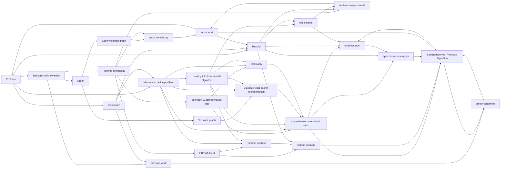

```mermaid 
flowchart LR
    1[Problem] --> 2 & 3 & 4 & 5
    2[Background knowledge] --> 2.1 & 2.2 & 2.3
	2.1[Graph] --> 2.1.1 & 2.1.2
	2.1.1[Vizualize graph] --> 3.2
	2.1.2[Edge weighted graph] --> 2.2.3 
	2.2[Runtime complexity] --> 2.2.1 & 2.2.2 & 2.2.3 & 4.2
	2.2.1[FTP W1-Hard] --> 3.3 & 4.3
	2.2.2[optimality & approximation algo] --> 3.4 & 3.5
	2.2.3[graph complexity] --> 5.2
	2.3[previous work] --> 2.3.1
	2.3.1[greedy algorithm] --> 5.1

    3[Methods to tackle problem] --> 3.1 & 3.2 & 3.3 & 3.4 & 3.5 
	3.1[Looking into local search algorithm] --> 3.2 & 3.3 & 3.4 & 3.5 & 4.1
	3.2[Vizualize local search representation] --> 3.5
	3.3[Runtime analysis] --> 4.3
	3.4[Optimality] --> 3.5
	3.5[approximation scenario & ratio] --> 4.4 & 4.5 & 5.1

    4[Results] --> 4.1 & 4.2 & 4.3 & 4.4 & 4.5 
	4.1[expiriments] --> 4.2 & 4.4
	4.2[runtime in experiments] --> 5.2
	4.3[runtime analysis] --> 5.1
	4.4[local optimum] --> 4.5
	4.5[approximation analysis] --> 5.1

    5[Discussion] --> 2.3 & 3 & 4
	5.1[Comparison with Previous Algorithm] --> 2.3.1 & 4.4 
	5.2[future work] --> 1 & 4 & 5.1
```